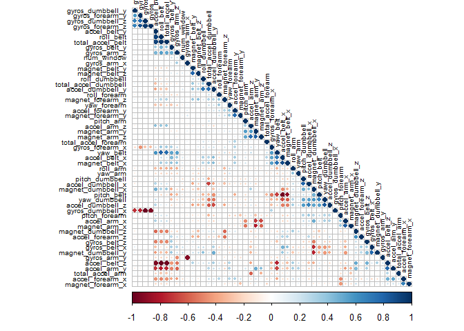

## I. Overview

One thing that people regularly do is quantify how much of a particular activity they do, but they rarely quantify how well they do it. In this project, goal is to use data from accelerometers on the belt, forearm, arm, and dumbell of 6 participants.

The goal of the project is to predict the manner in which they did the exercise. This is the "classe" variable in the training set. Any of the other variables to predict with. create a report describing how you built the model, how cross validation is done, the expected out of sample error, and what are the choices made in the execution. The prediction model is used to predict 20 different test cases.


This report describes Data Preprocessing , Correlation Analysis, and some of models are investigated for final prediction.


## II. Background

Using devices such as Jawbone Up, Nike FuelBand, and Fitbit it is now possible to collect a large amount of data about personal activity relatively inexpensively. These type of devices are part of the quantified self movement – a group of enthusiasts who take measurements about themselves regularly to improve their health, to find patterns in their behavior, or because they are tech geeks. One thing that people regularly do is quantify how much of a particular activity they do, but they rarely quantify how well they do it. In this project, the goal will be to use data from accelerometers on the belt, forearm, arm, and dumbell of 6 participants. They were asked to perform barbell lifts correctly and incorrectly in 5 different ways. More information is available from the website 

http://web.archive.org/web/20161224072740/
http:/groupware.les.inf.puc-rio.br/har
(see the section on the Weight Lifting Exercise Dataset).

## III. Data

The training data for this project are available here:

https://d396qusza40orc.cloudfront.net/predmachlearn/pml-training.csv

The test data are available here:

https://d396qusza40orc.cloudfront.net/predmachlearn/pml-testing.csv

The data for this project come from this source: http://web.archive.org/web/20161224072740/http:/groupware.les.inf.puc-rio.br/har.

## IV. Exploratory Analysis


## 1. Load libraries   


```r
set.seed(123)
library(caret)
library(corrplot)
library(rpart)
library(rattle)
```

## 2. Download data


```r
TrainFile="pml-training.csv"
TestFile="pml-testing.csv"

TrainUrl <- "https://d396qusza40orc.cloudfront.net/predmachlearn/pml-training.csv"
TestUrl <- "https://d396qusza40orc.cloudfront.net/predmachlearn/pml-testing.csv"

if(!file.exists(TrainFile))
{
    download.file(TrainUrl,TrainFile)
}
if(!file.exists(TestFile))
{
    download.file(TestUrl,TestFile)
}

rawdata <- read.csv(TrainFile,na.strings = c("", "NA"))
testset <- read.csv(TestFile, na.strings = c("", "NA"))
```

## 3. Data Preprocessing

### a) Splitting the data


```r
# create a train set and validation set from rawdata
rawindex  <- createDataPartition(rawdata$classe, p=0.7, list=FALSE)
training <- rawdata[rawindex, ]
validation  <- rawdata[-rawindex, ]
dim(training)
```

```
## [1] 13737   160
```

```r
dim(validation)
```

```
## [1] 5885  160
```

### b) Cleaning the data


```r
# remove columns having Nearly Zero Veriance
NZV <- nearZeroVar(training)
training <- training[, -NZV]
validation  <- validation[, -NZV]
dim(training)
```

```
## [1] 13737   124
```

```r
dim(validation)
```

```
## [1] 5885  124
```


```r
# remove variables that are mostly NA
AllNA    <- sapply(training, function(x) mean(is.na(x))) > 0.95
training <- training[, AllNA==FALSE]
validation  <- validation[, AllNA==FALSE]
dim(training)
```

```
## [1] 13737    59
```

```r
dim(validation)
```

```
## [1] 5885   59
```


```r
# remove identification only variables (columns 1 to 5)
training <- training[, -(1:5)]
validation  <- validation[, -(1:5)]
dim(training)
```

```
## [1] 13737    54
```

```r
dim(validation)
```

```
## [1] 5885   54
```


## 4. Correlation Analysis


```r
corMatrix <- cor(training[, -54])
par(mar=c(1,1,1,1))
corrplot(corMatrix, order = "hclust" , type = "lower",tl.cex = 0.6, tl.col = rgb(0, 0, 0))
```

<!-- -->


## 5. Liner Discriminant Analysis


```r
model_lda <- train(classe ~ ., data = training, method = "lda")
pred_lda <- predict(model_lda, validation)
confmatLDA<-confusionMatrix(validation$classe, pred_lda)
confmatLDA
```

```
## Confusion Matrix and Statistics
## 
##           Reference
## Prediction    A    B    C    D    E
##          A 1373   47  114  133    7
##          B  156  754  144   41   44
##          C  121   95  674  115   21
##          D   59   50  124  697   34
##          E   52  167  104  102  657
## 
## Overall Statistics
##                                           
##                Accuracy : 0.706           
##                  95% CI : (0.6942, 0.7177)
##     No Information Rate : 0.2992          
##     P-Value [Acc > NIR] : < 2.2e-16       
##                                           
##                   Kappa : 0.6278          
##                                           
##  Mcnemar's Test P-Value : < 2.2e-16       
## 
## Statistics by Class:
## 
##                      Class: A Class: B Class: C Class: D Class: E
## Sensitivity            0.7797   0.6774   0.5810   0.6406   0.8611
## Specificity            0.9270   0.9193   0.9255   0.9443   0.9170
## Pos Pred Value         0.8202   0.6620   0.6569   0.7230   0.6072
## Neg Pred Value         0.9079   0.9244   0.9000   0.9205   0.9779
## Prevalence             0.2992   0.1891   0.1971   0.1849   0.1297
## Detection Rate         0.2333   0.1281   0.1145   0.1184   0.1116
## Detection Prevalence   0.2845   0.1935   0.1743   0.1638   0.1839
## Balanced Accuracy      0.8533   0.7984   0.7533   0.7925   0.8890
```


```r
# plot LDA results
plot(confmatLDA$table, col = confmatLDA$byClass, 
     main = paste("LDA - Accuracy =", round(confmatLDA$overall['Accuracy'], 4)))
```

<!-- -->

## 6. Decision Tree


```r
model_dt <- rpart(classe ~ ., data = training, method = "class")
fancyRpartPlot(model_dt)
```

```
## Warning: labs do not fit even at cex 0.15, there may be some overplotting
```

<!-- -->


```r
pred_dt <- predict(model_dt, newdata = validation, type="class")
confmatDT<-confusionMatrix(validation$classe,pred_dt)
confmatDT
```

```
## Confusion Matrix and Statistics
## 
##           Reference
## Prediction    A    B    C    D    E
##          A 1459  104    0   92   19
##          B   86  855   57   81   60
##          C    0   61  856   99   10
##          D   13   75   37  759   80
##          E    2   51    3   86  940
## 
## Overall Statistics
##                                           
##                Accuracy : 0.8274          
##                  95% CI : (0.8175, 0.8369)
##     No Information Rate : 0.2651          
##     P-Value [Acc > NIR] : < 2.2e-16       
##                                           
##                   Kappa : 0.7823          
##                                           
##  Mcnemar's Test P-Value : NA              
## 
## Statistics by Class:
## 
##                      Class: A Class: B Class: C Class: D Class: E
## Sensitivity            0.9353   0.7461   0.8982   0.6795   0.8476
## Specificity            0.9503   0.9401   0.9655   0.9570   0.9703
## Pos Pred Value         0.8716   0.7507   0.8343   0.7873   0.8688
## Neg Pred Value         0.9760   0.9387   0.9800   0.9273   0.9648
## Prevalence             0.2651   0.1947   0.1619   0.1898   0.1884
## Detection Rate         0.2479   0.1453   0.1455   0.1290   0.1597
## Detection Prevalence   0.2845   0.1935   0.1743   0.1638   0.1839
## Balanced Accuracy      0.9428   0.8431   0.9319   0.8183   0.9089
```


```r
# plot DT results
plot(confmatDT$table, col = confmatDT$byClass, 
     main = paste("DT - Accuracy =", round(confmatDT$overall['Accuracy'], 4)))
```

<!-- -->

## 7. Generalized Boosted Model (GBM)


```r
ctrl_gbm <- trainControl(method = "repeatedcv", number = 3, repeats = 1)
model_gbm  <- train(classe ~ ., data = training, method = "gbm",
                  trControl = ctrl_gbm, verbose = FALSE)
pred_gbm<- predict(model_gbm, validation)
confmatGBM<-confusionMatrix(validation$classe, pred_gbm)
confmatGBM
```

```
## Confusion Matrix and Statistics
## 
##           Reference
## Prediction    A    B    C    D    E
##          A 1670    3    0    0    1
##          B    8 1118   13    0    0
##          C    0    9 1013    4    0
##          D    3    4    8  949    0
##          E    0    0    5   12 1065
## 
## Overall Statistics
##                                          
##                Accuracy : 0.9881         
##                  95% CI : (0.985, 0.9907)
##     No Information Rate : 0.2856         
##     P-Value [Acc > NIR] : < 2.2e-16      
##                                          
##                   Kappa : 0.985          
##                                          
##  Mcnemar's Test P-Value : NA             
## 
## Statistics by Class:
## 
##                      Class: A Class: B Class: C Class: D Class: E
## Sensitivity            0.9935   0.9859   0.9750   0.9834   0.9991
## Specificity            0.9990   0.9956   0.9973   0.9970   0.9965
## Pos Pred Value         0.9976   0.9816   0.9873   0.9844   0.9843
## Neg Pred Value         0.9974   0.9966   0.9946   0.9967   0.9998
## Prevalence             0.2856   0.1927   0.1766   0.1640   0.1811
## Detection Rate         0.2838   0.1900   0.1721   0.1613   0.1810
## Detection Prevalence   0.2845   0.1935   0.1743   0.1638   0.1839
## Balanced Accuracy      0.9963   0.9907   0.9861   0.9902   0.9978
```


```r
# plot GBM results
plot(confmatGBM$table, col = confmatGBM$byClass, 
     main = paste("GBM - Accuracy =", round(confmatGBM$overall['Accuracy'], 4)))
```

<!-- -->

## 8. Random Forest


```r
model_rf <- train(classe ~ ., data = training, method = "rf")
pred_rf <- predict(model_rf, validation)
confmatRF<-confusionMatrix(validation$classe, pred_rf)
```


```r
# plot RF results
plot(confmatRF$table, col = confmatRF$byClass, 
     main = paste("RF - Accuracy =", round(confmatRF$overall['Accuracy'], 4)))
```

<!-- -->

The predictive accuracy of the Random Forest model is maximum at 99.8 %.
Hence Random Forest model is considered for test set

## 9. Testing the model


```r
#Apply same set of trasformations applied to train set
NZV <- nearZeroVar(testset)
testing <- testset[, -NZV]
testing <- testing[, colSums(is.na(testing)) == 0]
testing <- testing[, -(1:5)]
dim(testing)
```

```
## [1] 20 54
```


```r
test_rf <- predict(model_rf, testing)
test_rf
```

```
##  [1] B A B A A E D B A A B C B A E E A B B B
## Levels: A B C D E
```

## V. References

Velloso, E.; Bulling, A.; Gellersen, H.; Ugulino, W.; Fuks, H. “Qualitative Activity Recognition of Weight Lifting Exercises. Proceedings of 4th International Conference in Cooperation with SIGCHI (Augmented Human ’13)”. Stuttgart, Germany: ACM SIGCHI, 2013.

